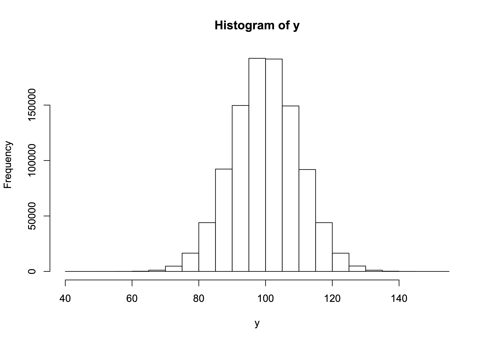
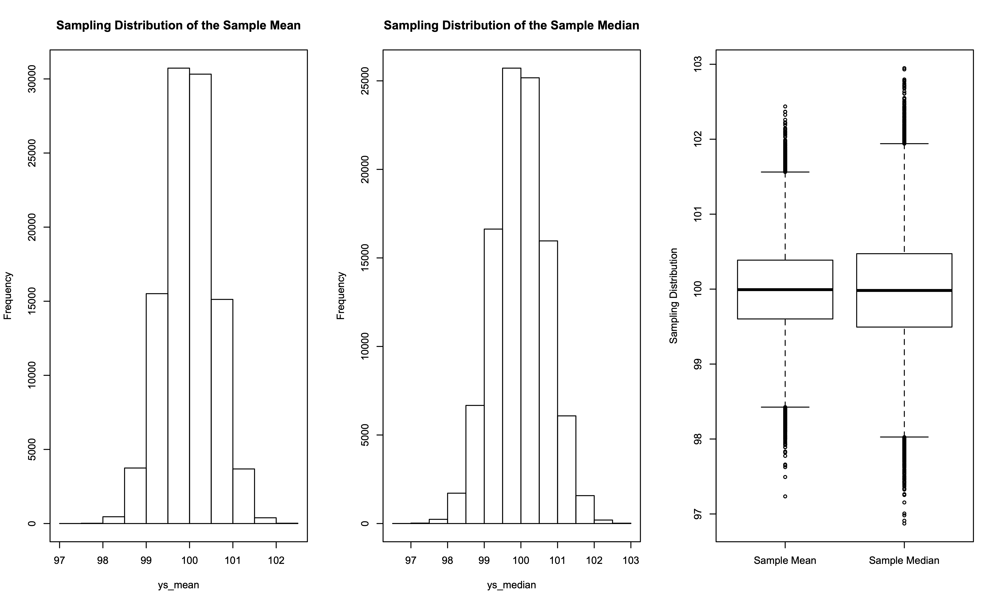
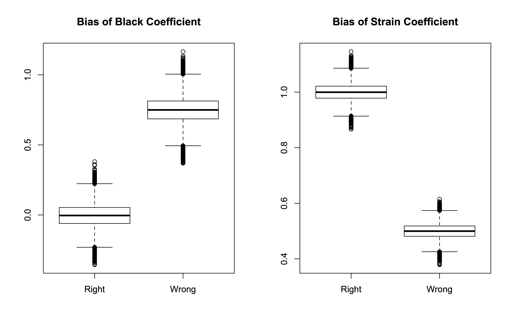

### Lesson 5 - Tuesday 2/11/20

Tonight's emphasis is on estimator properties. Specifically, we will be looking at efficiency, bias, and consistency.  Efficiency is an index of sampling variability; in general, we are looking for estimators that are as efficient as possible (smallest sampling variability). Bias is an index of how close the average of the sampling distribution for a population parameter estimate is to the actual correct and true value of the population parameter. Consistent estimators are biased in small samples but the bias vanishes as the sample size increases. Relevant readings for the ideas discussed in tonight's class are in:

* Wasserman (2004): Sections 9.4-9.8
* King (1989): Section 4.4

#### Efficiency

Suppose we have a population (N = 1M) distribution of *y* that is normally distributed with a mean of ~100 and a standard deviation of ~10. We can generate this distribution by:

```R
set.seed(279416)
y <- rnorm(n=1000000,mean=100,sd=10)
mean(y)
sd(y)
hist(y)
```

The output is:

```Rout
> set.seed(279416)
> y <- rnorm(n=1000000,mean=100,sd=10)
> mean(y)
[1] 99.99395
> sd(y)
[1] 9.99117
> hist(y)
```

and the population histogram is:

<p align="center">

</p>

Now, suppose we draw random samples of size N = 300 from this population and that we calculate both the mean and median for each sample. Further suppose that we let both the sample mean and the sample median be estimators of the population mean in each sample. Then, we will have two sampling distributions: one for the mean and one for the median. Which estimator performs "better"?

```R
# Calculate population mean

popmean <- mean(y)

# draw a single sample of size n=[sampsize] 
# from the population with replacement

sampsize <- 300
yss <- sample(y,size=sampsize,replace=T)

# calculate the sample mean 

mean(yss)

# calculate the sample median 

median(yss)

# now, let's repeat this process [nsamples] times

nsamples <- 100000

ys_mean <- vector()
se_mean <- vector()
ys_median <- vector()

for(i in 1:nsamples)
  {
   ys <- sample(y,size=sampsize,replace=T)
   ys_mean[i] <- mean(ys)
   se_mean[i] <- sd(ys)/sqrt(sampsize)
   ys_median[i] <- median(ys)
   }

# calculate the mean squared error (mse)

ys_mean_mse <- sum((ys_mean-popmean)^2)/nsamples
ys_median_mse <- sum((ys_median-popmean)^2)/nsamples

# look at the results

c(mean(ys_mean),sd(ys_mean),ys_mean_mse)
c(mean(ys_median),sd(ys_median),ys_median_mse)
mean(se_mean)
median(se_mean)

# charts

par(mfrow=c(1,3))
hist(ys_mean,main="Sampling Distribution of the Sample Mean")
box()
hist(ys_median,main="Sampling Distribution of the Sample Median")
box()
boxplot(ys_mean,ys_median,xaxt="n",ylab="Sampling Distribution")
axis(side=1,at=c(1,2),labels=c("Sample Mean","Sample Median"))
```

and here is the output:

```Rout
> # Calculate population mean
> 
> popmean <- mean(y)
> 
> # draw a single sample of size n=[sampsize] 
> # from the population with replacement
> 
> sampsize <- 300
> yss <- sample(y,size=sampsize,replace=T)
> 
> # calculate the sample mean 
> 
> mean(yss)
[1] 98.86404
> 
> # calculate the sample median 
> 
> median(yss)
[1] 99.47211
> 
> # now, let's repeat this process [nsamples] times
> 
> nsamples <- 100000
> 
> ys_mean <- vector()
> se_mean <- vector()
> ys_median <- vector()
> 
> for(i in 1:nsamples)
+   {
+    ys <- sample(y,size=sampsize,replace=T)
+    ys_mean[i] <- mean(ys)
+    se_mean[i] <- sd(ys)/sqrt(sampsize)
+    ys_median[i] <- median(ys)
+    }
> 
> # calculate the mean squared error (mse)
> 
> ys_mean_mse <- sum((ys_mean-popmean)^2)/nsamples
> ys_median_mse <- sum((ys_median-popmean)^2)/nsamples
> 
> # look at the results
> 
> c(mean(ys_mean),sd(ys_mean),ys_mean_mse)
[1] 99.9942200  0.5776531  0.3336798
> c(mean(ys_median),sd(ys_median),ys_median_mse)
[1] 99.9827350  0.7208414  0.5197331
> mean(se_mean)
[1] 0.5764864
> median(se_mean)
[1] 0.5762423
> 
> # charts
> 
> par(mfrow=c(1,3))
> hist(ys_mean,main="Sampling Distribution of the Sample Mean")
> box()
> hist(ys_median,main="Sampling Distribution of the Sample Median")
> box()
> boxplot(ys_mean,ys_median,xaxt="n",ylab="Sampling Distribution")
> axis(side=1,at=c(1,2),labels=c("Sample Mean","Sample Median"))
> 
```

And, here are 3 charts created by the program:

<p align="center">

</p>

#### Bias

To illustrate bias, we simulate a relatively simple regression problem. Let's suppose we have a population of 1M people; the dependent variable is a measure of future criminality and there are 2 independent variables: (1) race; and (2) a measure of economic strain. There are three issues that a researcher looking at this equation would need to confront: (1) race and economic strain might both be correlated with future criminality; (2) race and economic strain might be correlated with each other; and (3) race is probably measured better than economic strain. Here is some R code:

```R
options(scipen=100000)
set.seed(279416)
u1 <- rnorm(n=1000000,mean=0,sd=1)
u2 <- rnorm(n=1000000,mean=0,sd=1)
e <- rnorm(n=1000000,mean=0,sd=1)
black <- rbinom(n=1000000,size=1,prob=0.3)
true.strain <- 10+1.5*black+u1
measured.strain <- true.strain+u2
y <- 10+0*black+true.strain+e
reg.model1 <- lm(y~1+black+true.strain)
summary(reg.model1)
reg.model2 <- lm(y~1+black+measured.strain)
summary(reg.model2)
```

and here are the population results:

```Rout
> options(scipen=100000)
> set.seed(279416)
> u1 <- rnorm(n=1000000,mean=0,sd=1)
> u2 <- rnorm(n=1000000,mean=0,sd=1)
> e <- rnorm(n=1000000,mean=0,sd=1)
> black <- rbinom(n=1000000,size=1,prob=0.3)
> true.strain <- 10+1.5*black+u1
> measured.strain <- true.strain+u2
> y <- 10+0*black+true.strain+e
> reg.model1 <- lm(y~1+black+true.strain)
> summary(reg.model1)

Call:
lm(formula = y ~ 1 + black + true.strain)

Residuals:
    Min      1Q  Median      3Q     Max 
-4.6273 -0.6749  0.0000  0.6743  4.6135 

Coefficients:
             Estimate Std. Error t value            Pr(>|t|)    
(Intercept) 10.002722   0.010091 991.221 <0.0000000000000002 ***
black       -0.003643   0.002654  -1.373                0.17    
true.strain  0.999714   0.001002 997.533 <0.0000000000000002 ***
---
Signif. codes:  0 ‘***’ 0.001 ‘**’ 0.01 ‘*’ 0.05 ‘.’ 0.1 ‘ ’ 1

Residual standard error: 1.001 on 999997 degrees of freedom
Multiple R-squared:  0.5946,	Adjusted R-squared:  0.5946 
F-statistic: 7.333e+05 on 2 and 999997 DF,  p-value: < 0.00000000000000022

> reg.model2 <- lm(y~1+black+measured.strain)
> summary(reg.model2)

Call:
lm(formula = y ~ 1 + black + measured.strain)

Residuals:
    Min      1Q  Median      3Q     Max 
-5.6912 -0.8275  0.0005  0.8252  6.3937 

Coefficients:
                  Estimate Std. Error t value            Pr(>|t|)
(Intercept)     15.0022126  0.0087953  1705.7 <0.0000000000000002
black            0.7497580  0.0029738   252.1 <0.0000000000000002
measured.strain  0.4996217  0.0008673   576.1 <0.0000000000000002
                   
(Intercept)     ***
black           ***
measured.strain ***
---
Signif. codes:  0 ‘***’ 0.001 ‘**’ 0.01 ‘*’ 0.05 ‘.’ 0.1 ‘ ’ 1

Residual standard error: 1.226 on 999997 degrees of freedom
Multiple R-squared:  0.3927,	Adjusted R-squared:  0.3927 
F-statistic: 3.233e+05 on 2 and 999997 DF,  p-value: < 0.00000000000000022

> 
```

Now, let's draw repeated samples and estimate the two regression models in each sample:

```R
# Create the population data frame

popdf <- data.frame(y,black,true.strain,measured.strain)

# now, let's sample from the population [nsamples] times

nsamples <- 100000
sampsize <- 1000

black.coef.right <- vector()
black.coef.wrong <- vector()
strain.coef.right <- vector()
strain.coef.wrong <- vector()

for(i in 1:nsamples)
  {
   sdf <- popdf[sample(nrow(popdf),size=sampsize,replace=T), ]
   sample.reg.model1 <- lm(data=sdf,y~1+black+true.strain)
   sample.reg.model2 <- lm(data=sdf,y~1+black+measured.strain)
   black.coef.right[i] <- coef(sample.reg.model1)[2]
   black.coef.wrong[i] <- coef(sample.reg.model2)[2]
   strain.coef.right[i] <- coef(sample.reg.model1)[3]
   strain.coef.wrong[i] <- coef(sample.reg.model2)[3]
   }

# let's look at the results for the last sample

summary(sample.reg.model1)
summary(sample.reg.model2)

# calculate results

mean(black.coef.right)
sd(black.coef.right)
mean(strain.coef.right)
sd(strain.coef.right)

mean(black.coef.wrong)
sd(black.coef.wrong)
mean(strain.coef.wrong)
sd(strain.coef.wrong)

par(mfrow=c(1,2))
boxplot(black.coef.right,black.coef.wrong,
  main="Bias of Black Coefficient",
  names=c("Right","Wrong"))
boxplot(strain.coef.right,strain.coef.wrong,
  main="Bias of Strain Coefficient",
  names=c("Right","Wrong"))
```

Here is the R output:

```Rout
> # Create the population data frame
> 
> popdf <- data.frame(y,black,true.strain,measured.strain)
> 
> # now, let's sample from the population [nsamples] times
> 
> nsamples <- 100000
> sampsize <- 1000
> 
> black.coef.right <- vector()
> black.coef.wrong <- vector()
> strain.coef.right <- vector()
> strain.coef.wrong <- vector()
> 
> for(i in 1:nsamples)
+   {
+    sdf <- popdf[sample(nrow(popdf),size=sampsize,replace=T), ]
+    sample.reg.model1 <- lm(data=sdf,y~1+black+true.strain)
+    sample.reg.model2 <- lm(data=sdf,y~1+black+measured.strain)
+    black.coef.right[i] <- coef(sample.reg.model1)[2]
+    black.coef.wrong[i] <- coef(sample.reg.model2)[2]
+    strain.coef.right[i] <- coef(sample.reg.model1)[3]
+    strain.coef.wrong[i] <- coef(sample.reg.model2)[3]
+    }
> 
> # let's look at the results for the last sample
> 
> summary(sample.reg.model1)

Call:
lm(formula = y ~ 1 + black + true.strain, data = sdf)

Residuals:
    Min      1Q  Median      3Q     Max 
-3.1545 -0.6476  0.0147  0.6223  3.5763 

Coefficients:
            Estimate Std. Error t value            Pr(>|t|)    
(Intercept)  9.64714    0.31492  30.634 <0.0000000000000002 ***
black       -0.11831    0.08226  -1.438               0.151    
true.strain  1.03461    0.03118  33.185 <0.0000000000000002 ***
---
Signif. codes:  0 ‘***’ 0.001 ‘**’ 0.01 ‘*’ 0.05 ‘.’ 0.1 ‘ ’ 1

Residual standard error: 0.9699 on 997 degrees of freedom
Multiple R-squared:  0.6184,	Adjusted R-squared:  0.6177 
F-statistic:   808 on 2 and 997 DF,  p-value: < 0.00000000000000022

> summary(sample.reg.model2)

Call:
lm(formula = y ~ 1 + black + measured.strain, data = sdf)

Residuals:
    Min      1Q  Median      3Q     Max 
-3.9051 -0.8139  0.0448  0.8816  3.4579 

Coefficients:
                Estimate Std. Error t value             Pr(>|t|)    
(Intercept)     15.01061    0.28840  52.048 < 0.0000000000000002 ***
black            0.66626    0.09634   6.916      0.0000000000083 ***
measured.strain  0.50209    0.02849  17.622 < 0.0000000000000002 ***
---
Signif. codes:  0 ‘***’ 0.001 ‘**’ 0.01 ‘*’ 0.05 ‘.’ 0.1 ‘ ’ 1

Residual standard error: 1.229 on 997 degrees of freedom
Multiple R-squared:  0.3877,	Adjusted R-squared:  0.3865 
F-statistic: 315.6 on 2 and 997 DF,  p-value: < 0.00000000000000022

> 
> # calculate results
> 
> mean(black.coef.right)
[1] -0.003729556
> sd(black.coef.right)
[1] 0.08427171
> mean(strain.coef.right)
[1] 0.9998543
> sd(strain.coef.right)
[1] 0.03188875
> 
> mean(black.coef.wrong)
[1] 0.7496711
> sd(black.coef.wrong)
[1] 0.09467297
> mean(strain.coef.wrong)
[1] 0.4996718
> sd(strain.coef.wrong)
[1] 0.02753434
> 
> par(mfrow=c(1,2))
> boxplot(black.coef.right,black.coef.wrong,
+   main="Bias of Black Coefficient",
+   names=c("Right","Wrong"))
> boxplot(strain.coef.right,strain.coef.wrong,
+   main="Bias of Strain Coefficient",
+   names=c("Right","Wrong"))
> 
```

and here are the boxplots:

<p align="center">

</p>

### Consistency

We now consider a situation where a small sample estimator is biased but the bias diminishes as the sample size grows larger. Based on the NCVS, we would expect that rural households have a lower victimization risk. So, let's suppose we have a (1M) population of urban and rural households and a disparity in victimization risk that approximates what we see in the NCVS. Here is the R code:

```R
options(scipen=100000)
set.seed(394320258)
urban <- rbinom(n=1000000,size=1,prob=0.65)
z <- runif(n=1000000,min=0,max=1)
u <- log(z/(1-z))
ystar <- 0.5*urban+u
y <- rep(NA,1000000)
y[ystar>0] <- 1
y[ystar<0] <- 0
pop.df <- data.frame(y,urban)
table(pop.df$y,pop.df$urban)
pop.lr.model <- glm(y~1+urban,data=pop.df,family="binomial")
summary(pop.lr.model)
popoddsratio <- exp(coef(pop.lr.model)[2])
popoddsratio

# now, let's sample from the population [nsamples] times

nsamples <- 1000
sampsize <- 3000

urban.coef.large <- vector()

for(i in 1:nsamples)
  {
   sdf <- pop.df[sample(nrow(pop.df),size=sampsize,replace=T), ]
   large.logit <- glm(y~1+urban,data=sdf,family="binomial")
   urban.coef.large[i] <- exp(coef(large.logit)[2])
   }

# let's look at the results for the last sample

summary(large.logit)

# calculate results

mean(urban.coef.large)

# now, let's sample from the population [nsamples] times

nsamples <- 1000
sampsize <- 1000

urban.coef.medium <- vector()

for(i in 1:nsamples)
  {
   sdf <- pop.df[sample(nrow(pop.df),size=sampsize,replace=T), ]
   medium.logit <- glm(y~1+urban,data=sdf,family="binomial")
   urban.coef.medium[i] <- exp(coef(large.logit)[2])
   }

# let's look at the results for the last sample

summary(medium.logit)

# calculate results

mean(urban.coef.medium)

# now, let's sample from the population [nsamples] times

nsamples <- 1000
sampsize <- 50

urban.coef.small <- vector()

for(i in 1:nsamples)
  {
   sdf <- pop.df[sample(nrow(pop.df),size=sampsize,replace=T), ]
   small.logit <- glm(y~1+urban,data=sdf,family="binomial")
   urban.coef.small[i] <- exp(coef(small.logit)[2])
   }

# let's look at the results for the last sample

summary(small.logit)

# calculate results

mean(urban.coef.small)
```

and here is the output:

```Rout
> options(scipen=100000)
> set.seed(394320258)
> urban <- rbinom(n=1000000,size=1,prob=0.65)
> z <- runif(n=1000000,min=0,max=1)
> u <- log(z/(1-z))
> ystar <- 0.5*urban+u
> y <- rep(NA,1000000)
> y[ystar>0] <- 1
> y[ystar<0] <- 0
> pop.df <- data.frame(y,urban)
> table(pop.df$y,pop.df$urban)
   
         0      1
  0 174762 245504
  1 175537 404197
> pop.lr.model <- glm(y~1+urban,data=pop.df,family="binomial")
> summary(pop.lr.model)

Call:
glm(formula = y ~ 1 + urban, family = "binomial", data = pop.df)

Deviance Residuals: 
    Min       1Q   Median       3Q      Max  
-1.3951  -1.1793   0.9743   0.9743   1.1755  

Coefficients:
            Estimate Std. Error z value            Pr(>|z|)    
(Intercept) 0.004425   0.003379   1.309                0.19    
urban       0.494164   0.004239 116.585 <0.0000000000000002 ***
---
Signif. codes:  0 ‘***’ 0.001 ‘**’ 0.01 ‘*’ 0.05 ‘.’ 0.1 ‘ ’ 1

(Dispersion parameter for binomial family taken to be 1)

    Null deviance: 1360755  on 999999  degrees of freedom
Residual deviance: 1347136  on 999998  degrees of freedom
AIC: 1347140

Number of Fisher Scoring iterations: 4

> popoddsratio <- exp(coef(pop.lr.model)[2])
> popoddsratio
   urban 
1.639128 
> 
> # now, let's sample from the population [nsamples] times
> 
> nsamples <- 1000
> sampsize <- 3000
> 
> urban.coef.large <- vector()
> 
> for(i in 1:nsamples)
+   {
+    sdf <- pop.df[sample(nrow(pop.df),size=sampsize,replace=T), ]
+    large.logit <- glm(y~1+urban,data=sdf,family="binomial")
+    urban.coef.large[i] <- exp(coef(large.logit)[2])
+    }
> 
> # let's look at the results for the last sample
> 
> summary(large.logit)

Call:
glm(formula = y ~ 1 + urban, family = "binomial", data = sdf)

Deviance Residuals: 
    Min       1Q   Median       3Q      Max  
-1.4133  -1.1661   0.9586   0.9586   1.1888  

Coefficients:
            Estimate Std. Error z value          Pr(>|z|)    
(Intercept) -0.02672    0.06179  -0.432             0.665    
urban        0.56606    0.07758   7.296 0.000000000000296 ***
---
Signif. codes:  0 ‘***’ 0.001 ‘**’ 0.01 ‘*’ 0.05 ‘.’ 0.1 ‘ ’ 1

(Dispersion parameter for binomial family taken to be 1)

    Null deviance: 4075.2  on 2999  degrees of freedom
Residual deviance: 4021.7  on 2998  degrees of freedom
AIC: 4025.7

Number of Fisher Scoring iterations: 4

> 
> # calculate results
> 
> mean(urban.coef.large)
[1] 1.642454
> 
> # now, let's sample from the population [nsamples] times
> 
> nsamples <- 1000
> sampsize <- 1000
> 
> urban.coef.medium <- vector()
> 
> for(i in 1:nsamples)
+   {
+    sdf <- pop.df[sample(nrow(pop.df),size=sampsize,replace=T), ]
+    medium.logit <- glm(y~1+urban,data=sdf,family="binomial")
+    urban.coef.medium[i] <- exp(coef(large.logit)[2])
+    }
> 
> # let's look at the results for the last sample
> 
> summary(medium.logit)

Call:
glm(formula = y ~ 1 + urban, family = "binomial", data = sdf)

Deviance Residuals: 
    Min       1Q   Median       3Q      Max  
-1.4243  -1.1968   0.9492   0.9492   1.1582  

Coefficients:
            Estimate Std. Error z value Pr(>|z|)    
(Intercept)  0.04546    0.10663   0.426 0.669842    
urban        0.51840    0.13434   3.859 0.000114 ***
---
Signif. codes:  0 ‘***’ 0.001 ‘**’ 0.01 ‘*’ 0.05 ‘.’ 0.1 ‘ ’ 1

(Dispersion parameter for binomial family taken to be 1)

    Null deviance: 1351.5  on 999  degrees of freedom
Residual deviance: 1336.6  on 998  degrees of freedom
AIC: 1340.6

Number of Fisher Scoring iterations: 4

> 
> # calculate results
> 
> mean(urban.coef.medium)
[1] 1.76132
> 
> # now, let's sample from the population [nsamples] times
> 
> nsamples <- 1000
> sampsize <- 50
> 
> urban.coef.small <- vector()
> 
> for(i in 1:nsamples)
+   {
+    sdf <- pop.df[sample(nrow(pop.df),size=sampsize,replace=T), ]
+    small.logit <- glm(y~1+urban,data=sdf,family="binomial")
+    urban.coef.small[i] <- exp(coef(small.logit)[2])
+    }
> 
> # let's look at the results for the last sample
> 
> summary(small.logit)

Call:
glm(formula = y ~ 1 + urban, family = "binomial", data = sdf)

Deviance Residuals: 
    Min       1Q   Median       3Q      Max  
-1.5215  -1.1213   0.8687   0.8687   1.2346  

Coefficients:
            Estimate Std. Error z value Pr(>|z|)
(Intercept)  -0.1335     0.5175  -0.258    0.796
urban         0.9137     0.6328   1.444    0.149

(Dispersion parameter for binomial family taken to be 1)

    Null deviance: 66.406  on 49  degrees of freedom
Residual deviance: 64.302  on 48  degrees of freedom
AIC: 68.302

Number of Fisher Scoring iterations: 4

> 
> # calculate results
> 
> mean(urban.coef.small)
[1] 2.108745
> 
```

Assignment - Due Tuesday 2/18/20

1. For the efficiency problem above, convince yourself that the mean is still more efficient than the median even when the sample size is large (i.e., N = 1000).

2. The idea of bias is that inaccuracy doesn't improve with larger sample sizes. Increase the (repeated) sample size by a factor of 2 and see how your conclusions change (if at all).

3. For the consistency problem, change the population intercept from zero to -0.25 and reestimate the experiments. Describe how (if at all) your conclusions change.
